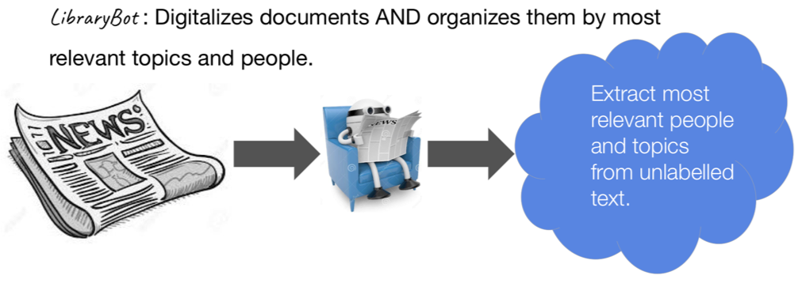

# LibraryBot - Topic and Entity Extraction for Historic Newspapers


## What is it?

This repository contains a barebones implementation of a topic and name entity extraction engine.
The implementation is based on leveraging pre-trained models from BERT combining with TFIDF for topic modeling and 
GloVe for name entity extraction.

It allows you to:
- Get OCR'd text from an input scanned image of newspaper.
- Extract relevant topics of newspaper and match them with Library of Congress subject listing. 
- Extract important person's names of newspaper and match them with Library of Congress name listing.


## Setup
Clone the repository locally and create a virtual environment (conda example below):
```
conda create -n librarybot python=3.6 -y
source activate librarybot
cd entity_topic_newspaper
pip install -r requirements.txt
```

Download a pre-trained BERT model, the example download provided below is BERT-Base, Uncased. 
Install Tesseract package, download SpaCy English and GloVe vectors (vector size 300):
```
cd model
curl -LO https://storage.googleapis.com/bert_models/2018_10_18/uncased_L-12_H-768_A-12.zip
unzip uncased_L-12_H-768_A-12.zip
curl -LO http://nlp.stanford.edu/data/glove.6B.zip
unzip glove.6B.zip
cd ..
python -m spacy download en
sudo apt install tesseract-ocr
sudo apt install libtesseract-dev
```


## Usage
### Running the model with pipeline end to end
Two example images are already included at data/img folder, so you can start running immediately.
Here is an example for running the pipeline end to end with default settings! 
```
python main.py 
```

### Run test 
After running the model, if you want to add additional new scanned images of newspaper:
```
python main.py --test
```

### More configurations
| Argument | Type | Default | Description |
|--------------------|------|-------------|----------------------------------------------------------------------------------------------------------------------------------------------------------------|
| `model_bert_dir` | str | './model/uncased_L-12_H-768_A-12'| folder path of the pre-trained BERT model. |
| `img_path`| str |'./data/img'| folder path of the document images. |
| `output_dir`| str | './output' | folder path of the outputs. |
| `model_conll_dir`| str | './model/conll_2003_en' | pretrained model for CONLL dataset. |
| `glove_file` | str | './model/glove.6B.300d.txt' | path to glove file |
| `max_seq_len` | int | `25` | maximum length of sequence, longer sequence will be trimmed on the right side. |
| `s3` | bool | False | If you plan to use images from S3 storage. |


## Creating a custom dataset
Below is the default structure of the data. 
```
data/
|
|--- img/
|      |-------image_0
|      |-------image_1
|      ...
|
|      |-------image_n
|--- topic_entity/
|      |-------topic_list.csv
|      |-------entity_list.csv
```
Each class name should be one word in the english language, or multiple words separated by '_'.

If you would like to import your own and not in this structure, please take a look at the More configurations section.

## Output structure
The revelant output directory are topic, name and text, where topic folder contains the relevant topic list per issue and 
name gives the important person's name list per issue. The text folder contains the OCR'd texts from images and can be reused for other purposes.

```
output/
|
|--- topic/
|      |-------issue_1.txt
|      |-------issue_2.txt
|      ... 
|
|      |-------issue_n.txt
|--- name/
|      |-------issue_1.csv
|      |-------issue_2.csv
|      ...
|      |-------issue_n.csv
|----text/
|      |-------issue_1.txt
|      |-------issue_2.txt
|      ...
|
|      |-------issue_n.txt
|----ner/
```
If you would like to import your own and not in this structure, please take a look at the More configurations section.


## Methods and References
BERT is a masked language model developed by [Google](https://github.com/google-research/bert). It contains two steps in the framework: pre-training and fine-tuning. During the pre-training, the model is trained on unlabeled BooksCorpus and English Wikipedia text. For fine-tuning, the BERT model is initialized with the pre-trained parameters with them fine-tuned for the downstream tasks. In the [paper](https://arxiv.org/abs/1810.04805), it is shown that the feature-based approach with BERT, where fixed features are extracted from the pre-trained model, is only slightly behind fine-tuning the entire model. One can then perform [sentence encoding](https://github.com/hanxiao/bert-as-service) using BERT, which goal is to represent a variable length sentence into a fixed length vector, e.g. `hello world` to `[0.1, 0.3, 0.9]`.   
